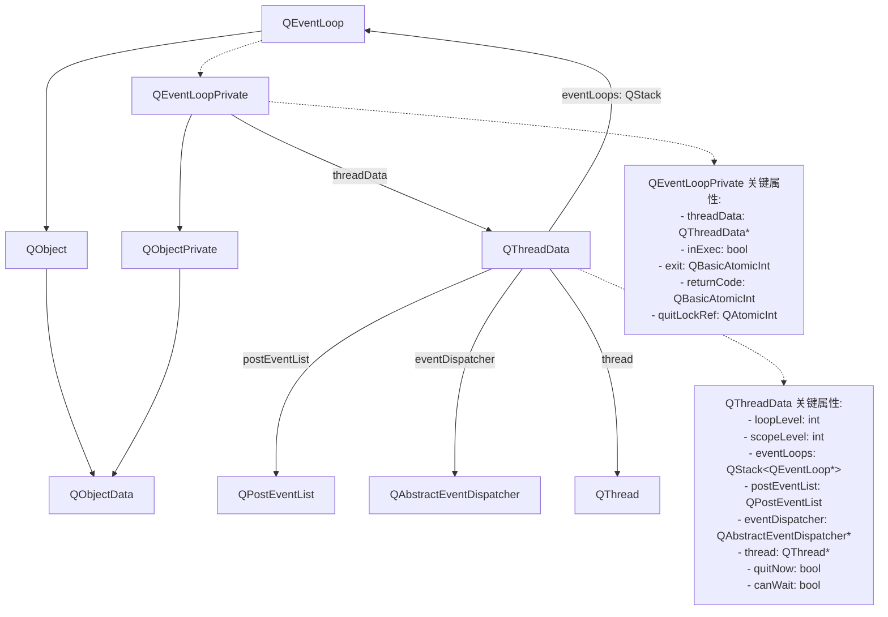
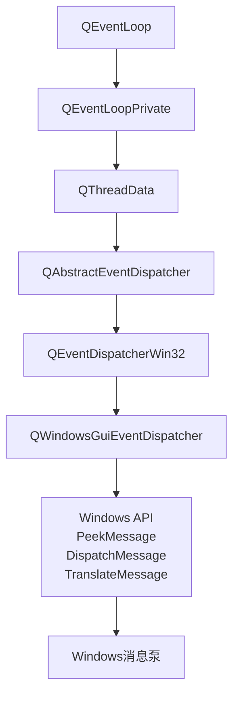
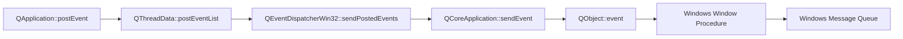
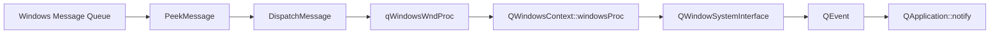

# Qt事件循环

# QThreadData和QEventLoop主要关系说明



### 1. 继承关系

*   QEventLoop 继承自 QObject
    
*   QEventLoopPrivate 继承自 QObjectPrivate
    
*   QObjectPrivate 继承自 QObjectData
    

### 2. 组合关系

*   **QEventLoop** 通过私有指针模式持有 **QEventLoopPrivate**
    
*   **QEventLoopPrivate** 持有 **QThreadData** 的指针引用
    
*   **QThreadData** 维护一个 **QEventLoop** 指针的栈（`QStack<QEventLoop *> eventLoops`）
    

### 3. 关键关系特点

**QThreadData 是核心枢纽：**

*   每个线程都有唯一的 QThreadData 实例
    
*   管理该线程中所有的事件循环栈
    
*   持有事件分发器和事件队列
    
*   跟踪循环嵌套级别
    

**QEventLoop 通过 QEventLoopPrivate 访问 QThreadData：**

*   在构造时获取当前线程的 QThreadData
    
*   执行时将自身推入 QThreadData 的事件循环栈
    
*   退出时从栈中移除自身
    

### 4. 生命周期管理

*   QThreadData 使用引用计数管理生命周期
    
*   QEventLoop 在 exec() 时会增加 QThreadData 的循环级别
    
*   支持嵌套事件循环，通过栈结构管理
    

这种设计使得Qt能够支持每个线程有自己的事件循环，同时支持嵌套事件循环的场景，是Qt事件系统的核心架构。

# QEventLoop与Windows消息泵集成原理

### 1. 架构层次结构



### 2. 核心工作流程

创建虚拟Wnd窗口注入窗口过程函数`qt_internal_proc`

```cpp
QWindowsMessageWindowClassContext::QWindowsMessageWindowClassContext()
    : atom(0), className(0)
{
    // make sure that multiple Qt's can coexist in the same process
    const QString qClassName = QStringLiteral("QEventDispatcherWin32_Internal_Widget")
        + QString::number(quintptr(qt_internal_proc));
    className = new wchar_t[qClassName.size() + 1];
    qClassName.toWCharArray(className);
    className[qClassName.size()] = 0;

    WNDCLASS wc;
    wc.style = 0;
    wc.lpfnWndProc = qt_internal_proc;
    wc.cbClsExtra = 0;
    wc.cbWndExtra = 0;
    wc.hInstance = GetModuleHandle(0);
    wc.hIcon = 0;
    wc.hCursor = 0;
    wc.hbrBackground = 0;
    wc.lpszMenuName = NULL;
    wc.lpszClassName = className;
    atom = RegisterClass(&wc);
    if (!atom) {
        qErrnoWarning("%ls RegisterClass() failed", qUtf16Printable(qClassName));
        delete [] className;
        className = 0;
    }
}

void QEventDispatcherWin32::createInternalHwnd()
{
    Q_D(QEventDispatcherWin32);

    if (d->internalHwnd)
        return;
    d->internalHwnd = qt_create_internal_window(this);

    // start all normal timers
    for (int i = 0; i < d->timerVec.count(); ++i)
        d->registerTimer(d->timerVec.at(i));
}
```

#### 步骤1：QEventLoop启动

**当调用** `**QEventLoop::exec()**` **时：**

```plaintext
int QEventLoop::exec(ProcessEventsFlags flags)
{
    Q_D(QEventLoop);
    auto threadData = d->threadData.loadRelaxed();
    
    // 将当前事件循环推入线程数据的栈中
    threadData->eventLoops.push(d->q_func());
    
    while (!d->exit.loadAcquire())
        processEvents(flags | WaitForMoreEvents | EventLoopExec);
}
```

#### 步骤2：事件处理委托

`**QEventLoop::processEvents()**` **将处理权委托给事件分发器：**

```plaintext
bool QEventLoop::processEvents(ProcessEventsFlags flags)
{
    Q_D(QEventLoop);
    auto threadData = d->threadData.loadRelaxed();
    return threadData->eventDispatcher.loadRelaxed()->processEvents(flags);
}
```

#### 步骤3：Windows专用事件分发器

**在Windows平台上，实际的事件分发器是** `**QWindowsGuiEventDispatcher**`**，它继承自** `**QEventDispatcherWin32**`**。**

### 3. Windows消息泵集成的核心机制

#### 关键函数：QEventDispatcherWin32::processEvents()

**这是连接Qt事件系统和Windows消息泵的关键函数：**

```plaintext
bool QEventDispatcherWin32::processEvents(QEventLoop::ProcessEventsFlags flags)
{
    // ... 省略部分代码
    
    while (!d->interrupt.loadRelaxed()) {
        MSG msg;
        bool haveMessage;
        
        // 1. 从Windows消息队列获取消息
        haveMessage = PeekMessage(&msg, 0, 0, 0, PM_REMOVE);
        
        if (haveMessage) {
            // 2. 过滤原生事件
            if (!filterNativeEvent(QByteArrayLiteral("windows_generic_MSG"), &msg, 0)) {
                // 3. 标准Windows消息处理
                TranslateMessage(&msg);  // 转换键盘消息
                DispatchMessage(&msg);   // 分发到窗口过程
            }
        }
        // 4. 等待更多消息
        else {
            waitRet = MsgWaitForMultipleObjectsEx(nCount, pHandles, 0, QS_ALLINPUT, MWMO_ALERTABLE);
        }
    }
}
```

### 4. QEvent到Windows Message的转换路径

#### 路径1：QEvent → Windows Message



#### 路径2：Windows Message → QEvent



### 5. 关键的Windows API调用

**在** `**QEventDispatcherWin32::processEvents()**` **中使用的核心Windows API：**

`**PeekMessage()**`**：从消息队列检索消息**

`**TranslateMessage()**`**：转换虚拟键消息为字符消息**

`**DispatchMessage()**`**：将消息分发到适当的窗口过程**

`**MsgWaitForMultipleObjectsEx()**`**：等待消息或其他内核对象**

### 6. 事件过滤和处理

#### 原生事件过滤

```plaintext
// 在分发前进行过滤
if (!filterNativeEvent(QByteArrayLiteral("windows_generic_MSG"), &msg, 0)) {
    TranslateMessage(&msg);
    DispatchMessage(&msg);
}
```

#### 窗口过程集成

**Qt注册了自己的窗口过程** `**qWindowsWndProc**`**，它：**

**接收Windows消息**

**转换为Qt事件**

**通过** `**QWindowSystemInterface**` **发送到Qt事件系统**

### 7. 总结

*   **QEventLoop通过以下方式与Windows消息泵集成：**
    
*   **统一的事件循环：Qt的事件循环直接集成了Windows消息泵**
    
*   **双向转换：Qt事件和Windows消息可以相互转换**
    
*   **原生集成：使用Windows原生API确保与系统的完美兼容**
    
*   **事件过滤：提供多层过滤机制处理特殊情况**
    
*   **异步处理：支持异步事件处理和等待机制**
    

**这种设计使得Qt应用能够：**

*   **响应系统级事件（如窗口消息、输入事件）**
    
*   **处理Qt特有的事件（如信号槽、定时器）**
    
*   **与其他Windows应用程序正确交互**
    
*   **维持良好的性能和响应性**
    

**整个机制的核心在于Qt并没有替代Windows的消息泵，而是将自己的事件处理无缝集成到Windows的消息处理机制中**