# 字体和QFont

# 字体基础知识

## 1.1 常用格式

> [https://docs.fileformat.com/font](https://docs.fileformat.com/font) 介绍了多种字体格式

| **类型** | **描述** |
| --- | --- |
| **TTF** | (True Type Font) 字体格式，Windows和Mac系统最常用的字体格式，其最大的特点就是它是由一种数学模式来进行定义的基于轮廓技术的字体 |
| **TTC** | (True Type Collection) 字体合集格式，TrueType字体集成文件(. TTC文件)，TTC是几个TTF合成的字库，安装后字体列表中会看到两个以上的字体 |
| **OTF** | (Open Type) 字体格式，OpenType是微软和Adobe共同开发的字体，微软的IE浏览器全部采用这种字体。致力于替代TrueType字体 |

## 1.2 字体发展史

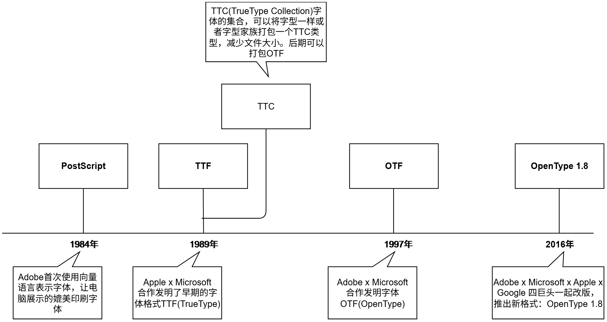

:::
总结：

TTF是最早开放的字体格式，TTF也是OpenType的一种

TTF格式字体与微软office比较兼容

OTF可以安装在Windows上，也可以安装在Mac上，还可以兼容多国家字符编码

OTF和TTF可以集合打包成一个文件格式：TTC

现代最常用的字体格式：OpenType1.8
:::

## 1.3 字体数据格式（以TTF格式为例）

TTF的二进制文件由 ++字体目录 + 字体正文表（n个）++ 组成，字体目录（Font Directory），包含多个字体正文表（Font Tables）

> 这里以“幼圆.ttf”为例

| **组成** | **二进制** |
| --- | --- |
| **字体目录（Font Directory）【文件头】**<br>```c++<br>struct FontDirectory {<br>  uint32 scaler_types;	// 文件类型<br>  uint16 number_tables;	// 字体正文表数量<br>  uint16 search_range;	// 16*(2的最大次方数不超过number_tables)<br>  uint16 entry_selector;	// log2(2的最大次方数不超过number_tables)<br>  uint16 range_shitf;		// 16*number_tables - search_range<br>};<br>``` | 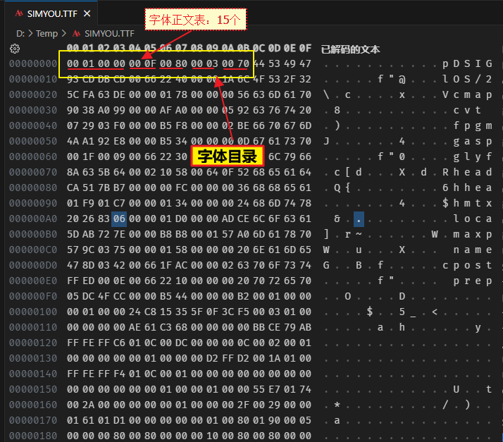 |
| **字体正文表（Font Tables）**<br>```text/x-c++src<br>struct TableDirectory {<br>  uint32 tag;		//正文表标签头<br>  uint32 check_sum; //校验串<br>  uint32 offset;	//正文表起始偏移<br>  uint32 length;	//正文表数据总长度<br>};<br>``` | 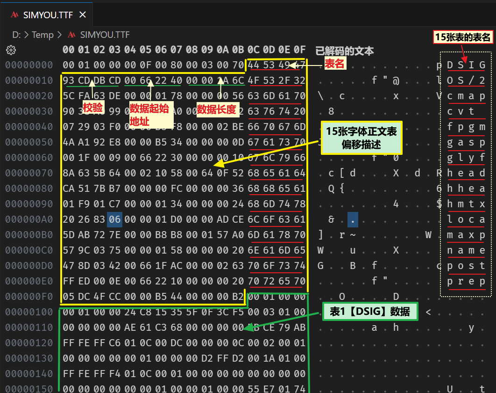 |

:::
下图列出了一些常用正文表的作用（可查询[https://developer.apple.com/fonts/TrueType-Reference-Manual/RM06/Chap6.html](https://developer.apple.com/fonts/TrueType-Reference-Manual/RM06/Chap6.html)）

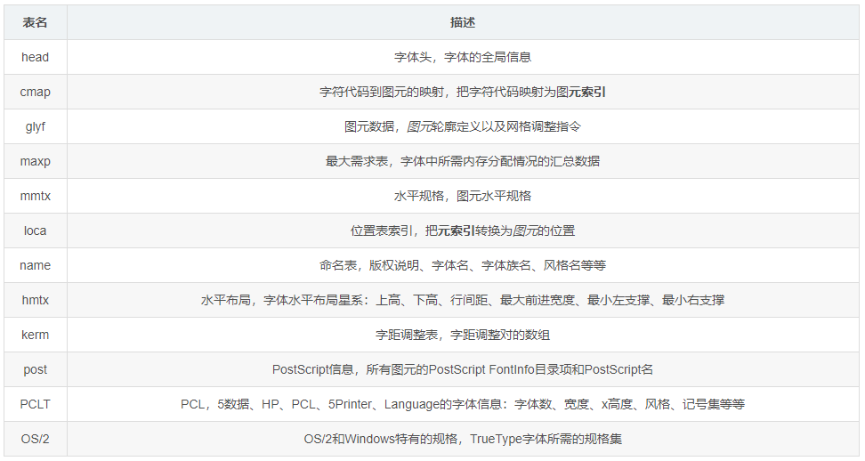
:::

## 1.4 字体常用术语

#### 整体视角

| 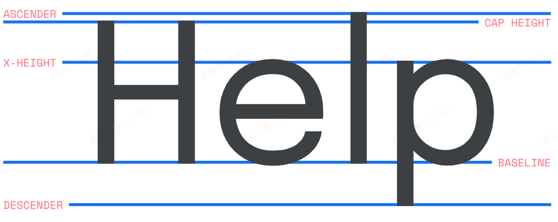 |
| --- |

#### 常用术语

| **术语** | **描述** | **示意** |
| --- | --- | --- |
| **埃姆(em)** | font-size字体大小，一个 em 就是 16px，**em框**的边界通常略高于**大写字母高度**，略低于字母**下降部**分 | 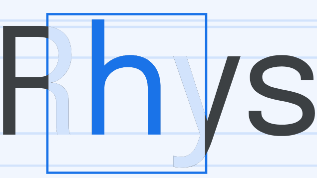 |
| **X高度(x-height)** | **X 高度**是可读性的一个重要因素（当 x 高度较大时，字体在小尺寸下可能更容易阅读） | 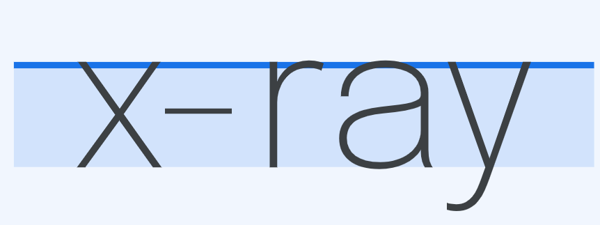 |
| **基线(baseline)** | **基线**是字母所在的一条不可见的线。它用作测量其他元素（例如line-height和x-height[）](https://fonts.google.com/knowledge/glossary/x_height)的点 | 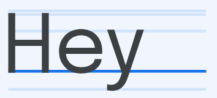 |
| **上升部(ascent)** | **上升部**是字母的向上部分,延伸到**x-height**以上 | 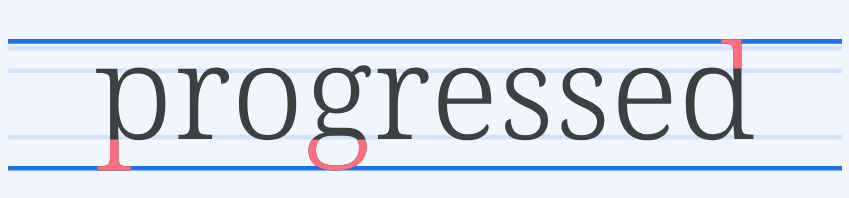 |
| **下降部(descent)** | **下降部**则相反：它是延伸到**基线**以下的向下笔画 |
| **大写字母高度(cap height)** | 这通常略低于**上升部**高度，并且大写字母高度在不同的字体之间可能有所不同 | 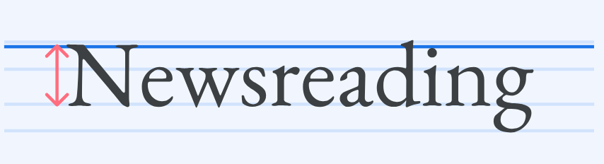 |
| **行高(line height)** | 从一行字样的**基线**到下一行字样的**基线**测量，“传统上，在金属活字中，这是字体大小和插入每行字样之间的铅条（称为“行距”）的组合测量值”<br>在设计应用程序中++设置 150% 的行高会将字体大小乘以 1.5++（最佳值位于 115% 到 150% 之间） | 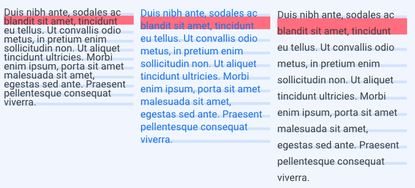 |
| **字距调整(Kerning)** | **字距调整**是手动调整++两个特定字形++之间的间距 | 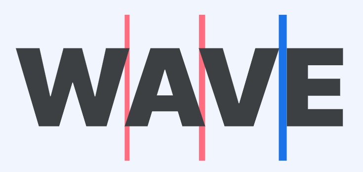 |
| **提示(Hinting)** | **提示**是将程序数据包含在字体文件中的过程，以++帮助文本渲染软件在++++**低分辨率**++++屏幕上以++++**小尺寸**++++清晰地呈现字体++<br>*   'cvt ' ：控制值表，包含对齐和调整字体的关键值。<br>    <br>*   'fpgm' ：字体程序表，包含全局字体 hinting 程序。<br>    <br>*   'prep' ：预程序表，用于设置控制值和预处理 hinting 指令 | 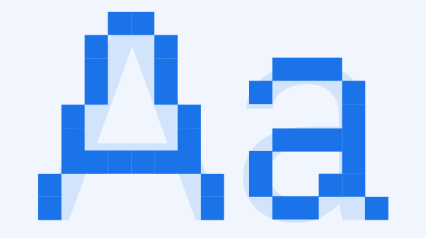 |
| **等宽字体(Monospaced)** | **等宽字体**是指所有或大多数字符占据相同数量的水平空间的字体。代码编辑器默认使用等宽字体。<br>等宽字体包括 Courier、Roboto Mono、Inconsolata、Source Code Pro和IBM Plex Mono。 | 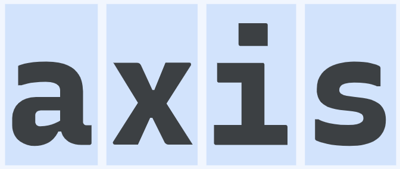 |
| **粗体(Bold)** | **粗体**是字体中最常见的一种粗细，其笔画总是比普通/直立字体更粗。粗体通常用于强调。<br>具体比其前面的粗细（通常是 Regular，但可能是 **Medium**）重多少，比其后面的粗细（通常是 **Extra Bold** 或 **Black**）轻多少，都是任意的，由字体设计师自行决定。 | 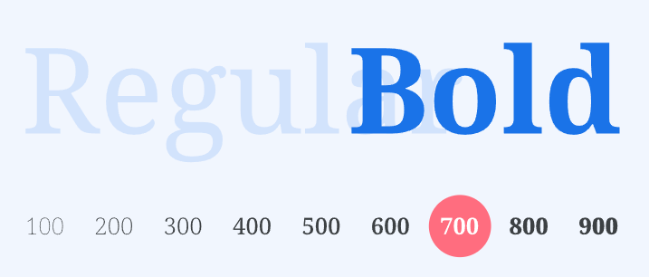 |
| **斜体(Italic)** | **斜体**是一种几乎总是倾斜的字体 样式，旨在强调文本。<br>当无法使用真正的斜体（或真正的斜体）时，软件可能会呈现“仿”斜体 | 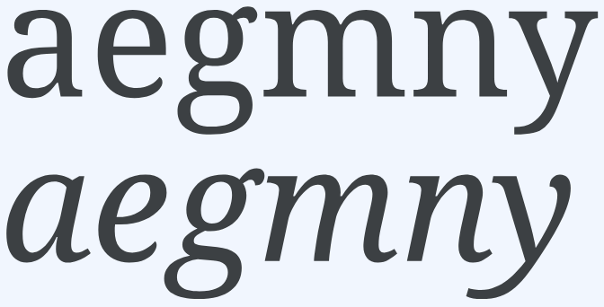 |
| **字体收缩、扩展**(**Condensed, Extended**) | **字体收缩**通常表示比正常宽度更窄<br>**字体扩展**通常表示比正常宽度更宽 | 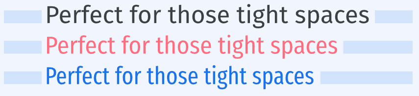 |
| **字重(Weight)** | 字体粗细范围从最细（即最薄）的细线和超细到最粗（即最粗）的黑色或超粗。注意：各个粗细的实际命名是任意的，取决于各个字体设计师或字体铸造厂。 |  |

> [https://fonts.google.com/knowledge/glossary#a-d](https://fonts.google.com/knowledge/glossary#a-d) 介绍了字体常用的术语

## 1.5 字体渲染

> 学习网站： [https://developer.apple.com/fonts/TrueType-Reference-Manual/](https://developer.apple.com/fonts/TrueType-Reference-Manual/)

### 1.5.1 字体引擎处理流程

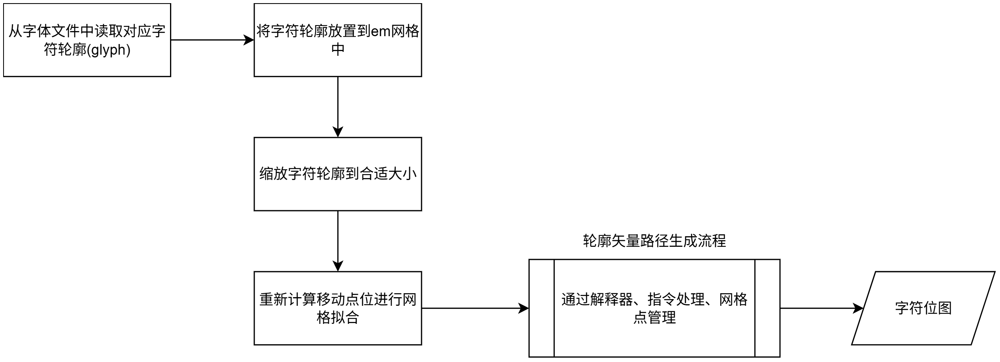

| **字符轮廓** | **轮廓比例缩放** | **网格拟合** | **栅格图像** |
| --- | --- | --- | --- |
| 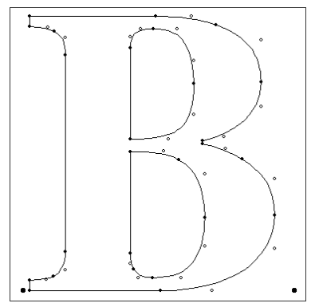<br>点位数据（贝塞尔曲线） | 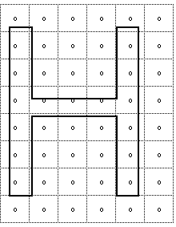 | 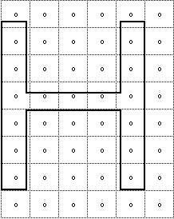 | 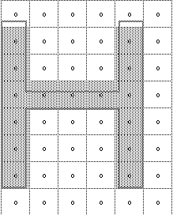 |

### 1.5.2 字体轮廓数据生成

我们可以简单通过上述ttf文件里的3张表可以做到获取一个字符的字形矢量数据

*   hmtx: （字形的水平宽度）
    
*   cmap: （unicode 到 字形 index 的映射）
    
*   glyf: （字形数据）
    

通过一些三方解析库，获取了幼圆.ttf的Font Table的数据，这里以数字“0”为例，轮廓是如何生成的：

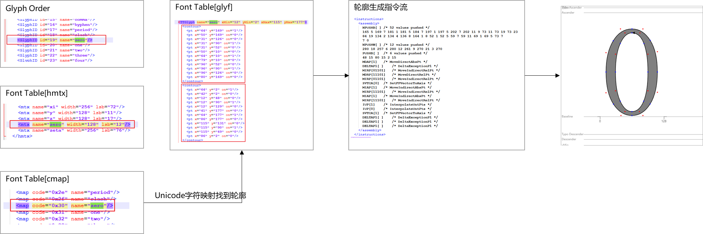

### 1.5.3 字体抗锯齿

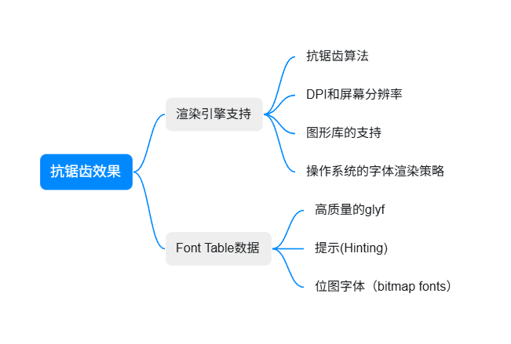

# QFont

## 2.1 Enum

| **分类** | **值** | **描述** |
| --- | --- | --- |
| QFont::**Capitalization**<br>（方便地让字体直接刷成大小写） | *   QFont::MixedCase   **默认**<br>    <br>*   QFont::AllUppercase<br>    <br>*   QFont::AllLowercase<br>    <br>*   QFont::SmallCaps<br>    <br>*   QFont::Capitalize | *   混合<br>    <br>*   全大写<br>    <br>*   全小写<br>    <br>*   小型大写字母（小型大写字母的高度小于普通大写字母，但大于小写字母）<br>    <br>*   首字母转换为大写 |
| QFont::**HintingPreference**<br>（字体术语：提示） | *   QFont::PreferDefaultHinting **默认**<br>    <br>*   QFont::PreferNoHinting<br>    <br>*   QFont::PreferVerticalHinting<br>    <br>*   QFont::PreferFullHinting | *   字体渲染引擎决定<br>    <br>*   禁用 hinting（高分辨率显示器上，可能不需要 hinting，因为高像素密度可以提供足够的清晰度）<br>    <br>*   只应用垂直方向的 hinting（在某些字体或显示设置下，这可以提供更平滑的水平线条，但仍保持垂直对齐的清晰度）<br>    <br>*   应用完整的 hinting（适用于需要最大清晰度的低分辨率显示器，但可能会影响字体的自然形状）<br>    <br>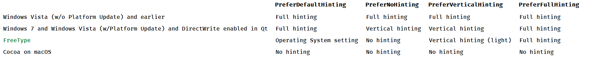 |
| QFont::**SpacingType**<br>（控制字符之间的间距） | *   QFont::PercentageSpacing **默认**<br>    <br>*   QFont::AbsoluteSpacing | *   百分比<br>    <br>*   绝对值（px） |
| QFont::**Stretch**<br>（字体术语：收缩、扩展） | *   QFont::AnyStretch<br>    <br>*   QFont::UltraCondensed<br>    <br>*   QFont::ExtraCondensed<br>    <br>*   QFont::Condensed<br>    <br>*   QFont::SemiCondensed<br>    <br>*   QFont::Unstretched    **默认**<br>    <br>*   QFont::SemiExpanded<br>    <br>*   QFont::Expanded<br>    <br>*   QFont::ExtraExpanded<br>    <br>*   QFont::UltraExpanded |  |
| QFont::**Style**<br>（描述字形轮廓风格） | *   QFont::StyleNormal    **默认**<br>    <br>*   QFont::StyleItalic<br>    <br>*   QFont::StyleOblique | *   没有风格<br>    <br>*   真正的斜体，需要字体字形支持<br>    <br>*   仿斜体，不需要字体字形支持，只是将常规字体倾斜 |
| QFont::**StyleHint**<br>（字体族风格降级选择） | *   QFont::AnyStyle   **默认**<br>    <br>*   QFont::SansSerif<br>    <br>*   QFont::Helvetica<br>    <br>*   QFont::Serif<br>    <br>*   QFont::Times<br>    <br>*   QFont::TypeWriter<br>    <br>*   QFont::Courier<br>    <br>*   QFont::OldEnglish<br>    <br>*   QFont::Decorative<br>    <br>*   QFont::Monospace<br>    <br>*   QFont::Fantasy<br>    <br>*   QFont::Cursive<br>    <br>*   QFont::System | *   Qt的字体匹配算法完成选择<br>    <br>*   Sans Serif字体<br>    <br>*   Sans Serif字体<br>    <br>*   Serif字体<br>    <br>*   Serif字体<br>    <br>*   Type Writer字体<br>    <br>*   Type Writer字体<br>    <br>*   Old English字体<br>    <br>*   优先选择映射到 CSS 通用Monospace字体 <br>    <br>*   优先选择映射到 CSS 通用Fantasy字体<br>    <br>*   优先选择映射到 CSS 通用Cursive字体 <br>    <br>*   系统字体<br>    <br>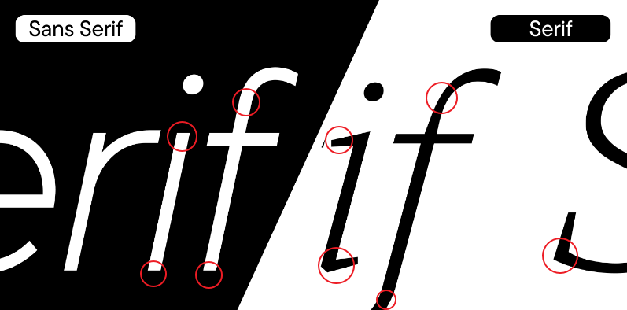<br>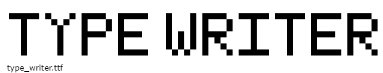<br>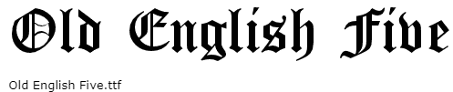<br>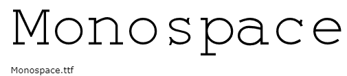<br>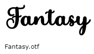<br>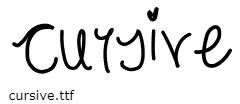 |
| QFont::**StyleStrategy**<br>（样式策略：辅助字体匹配算法应该使用什么类型的字体来查找合适的默认族） | *   QFont::PreferDefault   **默认**<br>    <br>*   QFont::PreferBitmap<br>    <br>*   QFont::PreferDevice<br>    <br>*   QFont::PreferOutline<br>    <br>*   QFont::ForceOutline<br>    <br>*   QFont::NoAntialias<br>    <br>*   QFont::NoSubpixelAntialias<br>    <br>*   QFont::PreferAntialias<br>    <br>*   QFont::OpenGLCompatible<br>    <br>*   QFont::NoFontMerging<br>    <br>*   QFont::PreferNoShaping | *   不做任何倾向<br>    <br>*   优先选择“位图字体”<br>    <br>*   优先选择显示设备或打印机支持的字体<br>    <br>*   优先选择包含轮廓信息的矢量字体<br>    <br>*   强制选择包含轮廓信息的矢量字体<br>    <br>*   不使用抗锯齿<br>    <br>*   不使用子像素抗锯齿<br>    <br>*   优先抗锯齿<br>    <br>*   优先使用 OpenGL 渲染时的最佳兼容<br>    <br>*   禁用从其他字体中合并缺失字符<br>    <br>*   禁用复杂文本形状处理，优化性能 |
| QFont::**Weight**<br>（字体术语：字重） | *   QFont::Thin<br>    <br>*   QFont::ExtraLight<br>    <br>*   QFont::Light<br>    <br>*   QFont::Normal    **默认**<br>    <br>*   QFont::Medium<br>    <br>*   QFont::DemiBold<br>    <br>*   QFont::Bold<br>    <br>*   QFont::ExtraBold<br>    <br>*   QFont::Black |  |

## 2.2 字体族和字体降级

### 2.2.1 字体族设置

目前有3种设置字体族的方法：

```c++
// 1. 构造函数
QFont f("微软雅黑");

// 2. setFamily setFamilies
f.setFamily("微软雅黑");
QStringList fonts = { "Arial",  "微软雅黑", "黑体"};
f.setFamilies(fonts);

// qss设置
QWidget {
  font-family: "Arial","微软雅黑","黑体";
};
```

### 2.2.2 字体匹配与降级

*   **字体匹配算法：**QFont::**setStyleHint**(QFont::**StyleHint** hint, QFont::**StyleStrategy** strategy = PreferDefault)
    

1.  搜索指定的字体族（由 setFamilies() 设置）
    
2.  如果未找到：则会选择指定的字体族，如果该字体族存在并可用于表示正在使用的书写系统
    
3.  如果没有：则会选择一个支持该书写系统的++替代字体++。字体匹配算法将尝试为 QFont 中设置的所有属性找到最佳匹配。具体方法因平台而异
    
4.  如果系统中不存在支持文本的字体，则会显示特殊的 ++“缺失字符 ”框++。
    

*   **匹配算法findFont()源码流程：**
    

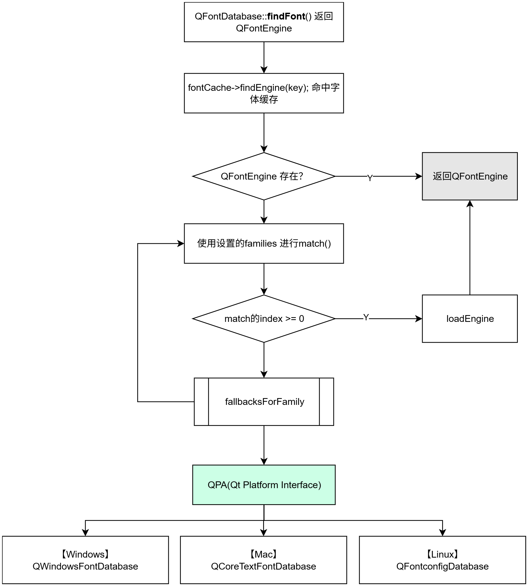

:::
[问号]这个就可以解释：

为什么我们在Windows平台上写的一个QLabel { font-family:“微软雅黑”; }，在Mac平台下看到依旧是苹方字体
:::

*   **手动设置降级备选字体3种方法**
    

1.  通过设置QFont::**setFontFamilies**，尽可能设置好使用的字体族
    
2.  通过设置QFont::**setStyle**，启用Qt预设的字体风格
    
3.  通过QFont::**insertSubstitution**设置统一的备选字体
    

```c++
// 跨平台统一设置
QFont::insertSubstitutions("DtTextFont", QStringList() << "微软雅黑" << "PingFang PC");
```

## 2.3 常用字体属性设置

| **API** | **属性** | **描述** |
| --- | --- | --- |
| QFont::**setFixedPitch**(**bool** _enable_) | **等宽字体(Monospaced)** | 启用等宽 |
| QFont::**setHintingPreference**([**QFont::HintingPreference**](qfont.html#HintingPreference-enum)_hintingPreference_) | **字体提示(Hinting)** | 设置字体提示 |
| QFont::**setItalic**(**bool** _enable_) | **粗体(Bold)** |  |
| QFont::**setItalic**(**bool** _enable_) | **斜体(Italic)** | 启用斜体 |
| QFont::**setStretch**(**int** _factor_) | **字体收缩、扩展**(**Condensed, Extended**) | 设置字体收缩或者扩展 |
| QFont::**setBold**(**bool** _enable_) | **粗体(Bold)** | 启用粗体 |
| QFont::**setKerning**(**bool** _enable_) | **字距调整(Kerning)** | 启用字距调整 |
| QFont::**setWeight**(**int** _weight_) | **字重(Weight)** | 设置字重 |
| QFont::**setOverline**(**bool** _enable_) | **上划线** | 启用上划线 |
| QFont::**setStrikeOut**(**bool** _enable_) | **删除线** | 启用删除线 |
| QFont::**setUnderline**(**bool** _enable_) | **下划线** | 启用下划线 |
| QFont::**setPixelSize**(**int** _pixelSize_) | **像素** | *   pt 是一个长度单位，常用于印刷和排版。1 pt 等于 1/72 英寸<br>    <br>*   px 是一个像素单位，主要用于屏幕显示<br>    <br>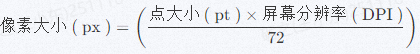 |
| QFont::**setPointSize**(**int** _pointSize_) | **点** |
| QFont::**setLetterSpacing**([**QFont::SpacingType**](qfont.html#SpacingType-enum)_type_, [**qreal**](../qtcore/qtglobal.html#qreal-typedef)_spacing_) | **字符间距** | 设置字符间距 |
| QFont::**setWordSpacing**([**qreal**](../qtcore/qtglobal.html#qreal-typedef)_spacing_) | **单词间距** | 设置单词间距 |
| QFont::**setCapitalization**([**QFont::Capitalization**](qfont.html#Capitalization-enum)_caps_) | **大小写** | 设置字体大小写方式 |
| QFont::**setStyle**([**QFont::Style**](qfont.html#Style-enum)_style_) | **斜体风格配置** | 设置备斜体风格 |
| QFont::**setStyleHint**([**QFont::StyleHint**](qfont.html#StyleHint-enum)_hint_, [**QFont::StyleStrategy**](qfont.html#StyleStrategy-enum)_strategy_ = PreferDefault) | **备选字体风格** | 设置备选字体风格 |
| QFont::**setStyleStrategy**([**QFont::StyleStrategy**](qfont.html#StyleStrategy-enum)_s_) | **备选字体选择策略** | 设置字体风格和质量备选策略 |

# 探索使用QFont渲染字体更好看 

## 现有经验

我们目前在线上Qt应用中，文本的抗锯齿的配置方式如下：

```c++
QFont DescribeFont(const QString& font_family,
                   const int32_t pixel_size,
                   const int32_t weight,
                   bool italic) {
  QFont font;
  font.setFamily(font_family);
  font.setWeight(weight);
  font.setPixelSize(pixel_size);

  //===================================================
  font.setStyleStrategy(QFont::PreferAntialias);
  font.setHintingPreference(QFont::PreferNoHinting);
  //===================================================

  font.setItalic(italic);
  return font;
}
```

[警告]目前存在问题： **非高清屏下，字体变形严重**

:::
**一起来找茬**

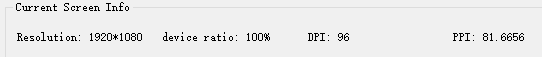

| **(线上使用)**<br>font.setStyleStrategy(QFont::PreferAntialias);<br>font.setHintingPreference(QFont::PreferNoHinting); | font.setStyleStrategy(QFont::PreferAntialias); |
| --- | --- |
| 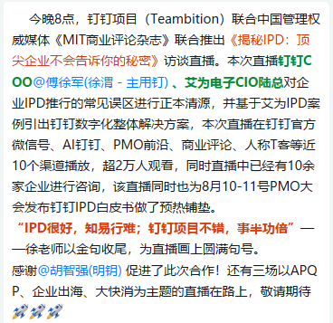 | 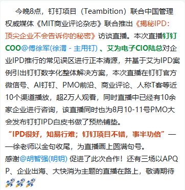 |
:::

## 寻找最佳实践

*   **Windows线上用户显示器分辨率分布**
    
    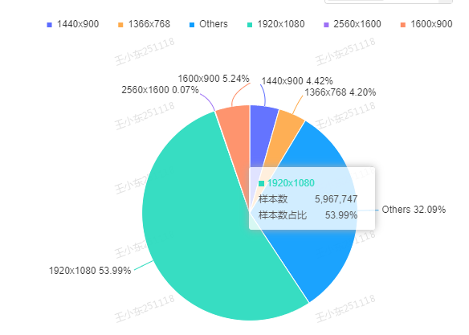
    
*   **字体如何高质量渲染**
    

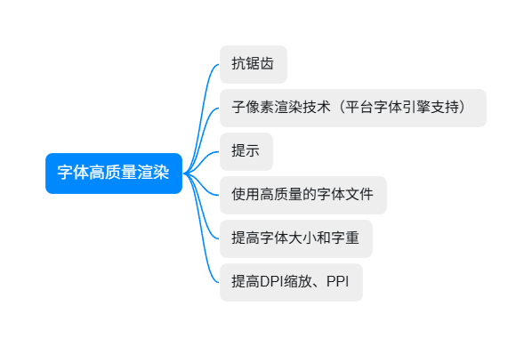

目前字体质量“微软雅黑”“Ping Fang PC”这些都是固定的，我们可以操作的部分：

*   提示（Hinting）
    
*   字体大小
    
*   提高DPI缩放、PPI
    

:::
**结论： 我们需要找到**++**在合适的PPI下，DPI缩放下，启用提示的默认字体大小边界值**++
:::

### 非高分屏（低于2K）

> 分辨率：1920\*1080       文本缩放 100%

> DPI: 96     PPI: 81.6656

| **字体大小 px** | **QFont::PreferDefaultHinting** | **QFont::PreferNoHinting** |
| --- | --- | --- |
| 12 | 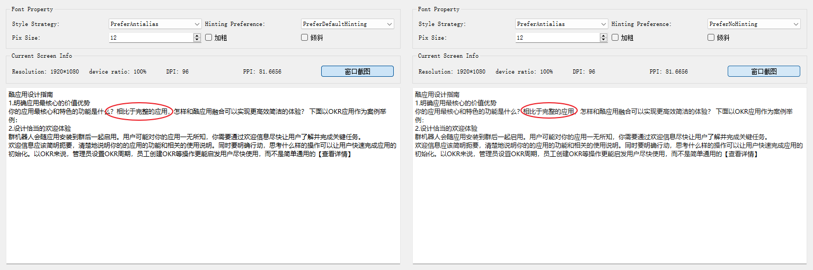 |  |
| 14 | 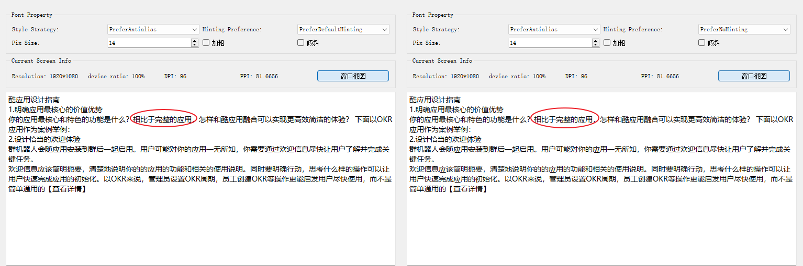<br>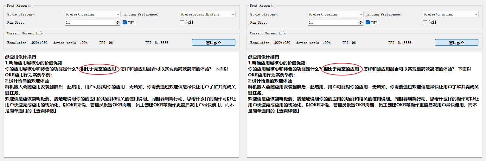 |  |
| 18 | 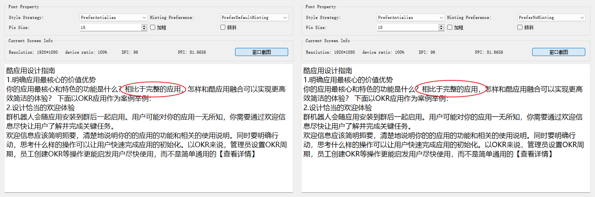 |  |
| 24 | 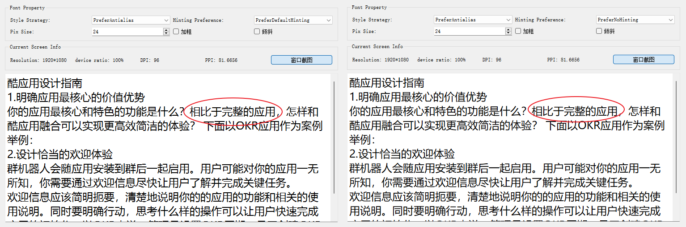 |  |
| 36 | 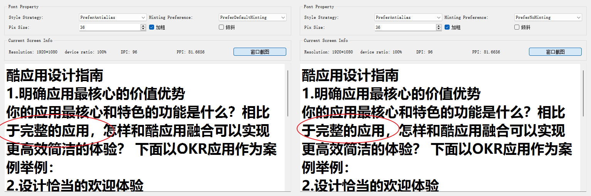 |  |

### 优化策略

*   **对比结果**
    

:::
开启**QFont::PreferNoHinting**的边界条件

**字号 >= 18px**

**PPI > 81px**

此时，字体渲染效果肉眼感知最佳，抗锯齿和字形更柔和

我们以1920\*1080 PPI为边界线，主要因为：

目前这是线上主流分辨率

我们测试了1600\*900 、1400\*900、1366\*768这几种分辨率，是否开启NoHinting并没有太大影响，使用DefaultHinting会是更好的选择
:::

*   **整体策略**
    

:::
**Step1 获取当前屏幕PPI**

$PPI = 缩放比 \* physicalDotsPerInch()$

**Step2 根据缩放比获得18原始字号**

$Px = 18 / 缩放比$

**Step3 是否启用PreferNoHinting**

```c++
int current_font_px = 14;

QFont::HintingPreference hinting_type = QFont::PreferDefaultHinting;
const auto screen = GetWidgetOnScreen(this);
const auto dpi_ratio = screen->devicePixelRatio();
auto ppi = screen->physicalDotsPerInch() * dpi_ratio;
auto origin_et_font_px = 18 / dpi_ratio;
if(ppi > 81 && current_font_px > origin_et_font_px) {
  hinting_type = QFont::PreferNoHinting;
}
```
:::

### 方案验证

> 分辨率：2560\*1440       文本缩放 200%

> DPI: 96     PPI: 108.8888

| **字体大小 px** | **QFont::PreferDefaultHinting** | **QFont::PreferNoHinting** |
| --- | --- | --- |
| 6 | 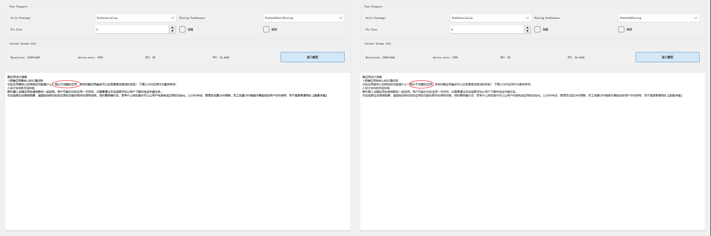 |  |
| 7 | 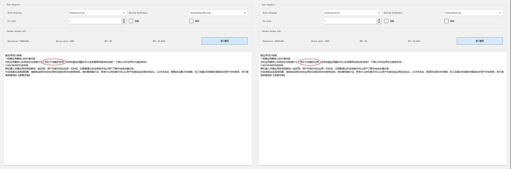<br>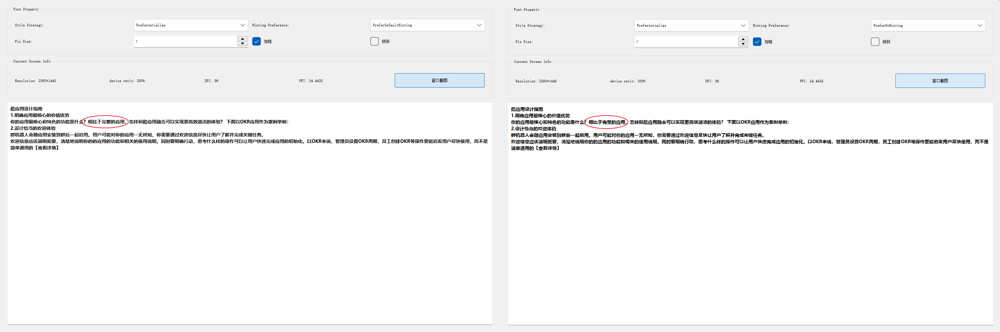 |  |
| 9 | 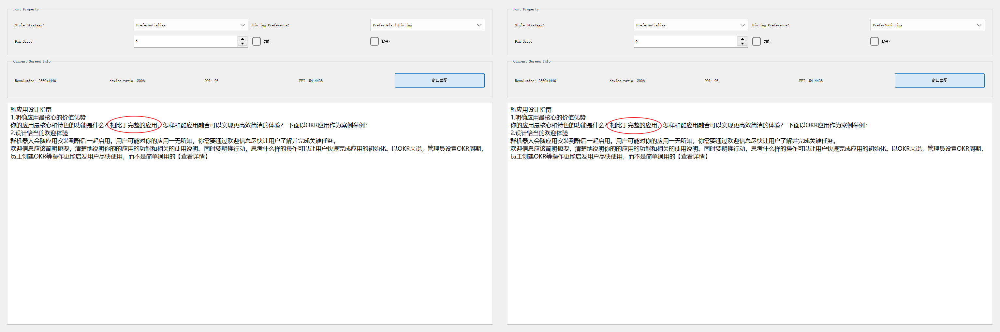 |  |
| 12 | 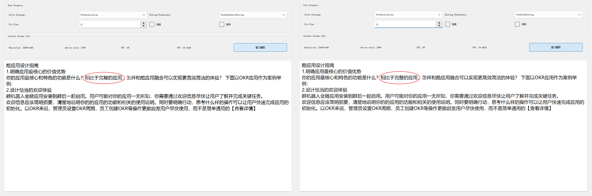 |  |
| 18 | 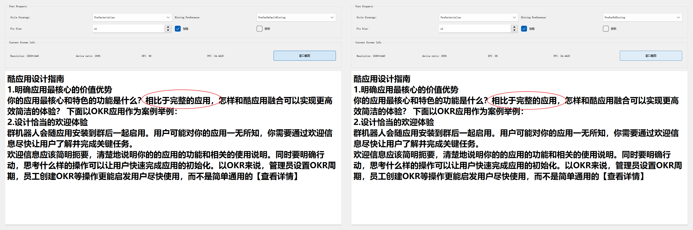 |  |