# 无障碍与QAccessible

# 背景

## 1.1 无障碍理念

**无障碍（Accessibility）**：指通过设计、技术或服务，确保所有人（包括残障人士、老年人、孕妇、临时受伤者等）都能平等、便捷地获取信息、使用设施、参与社会活动的理念和实践。其核心是消除环境、产品或服务中的障碍，实现包容型社会。

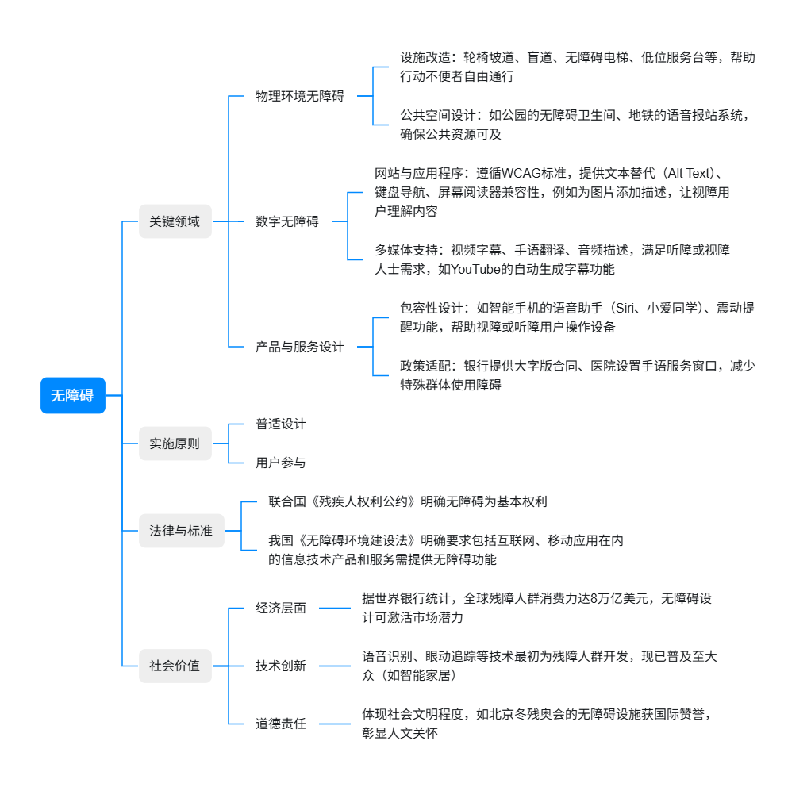

## 1.2 无障碍受众群体具体需求

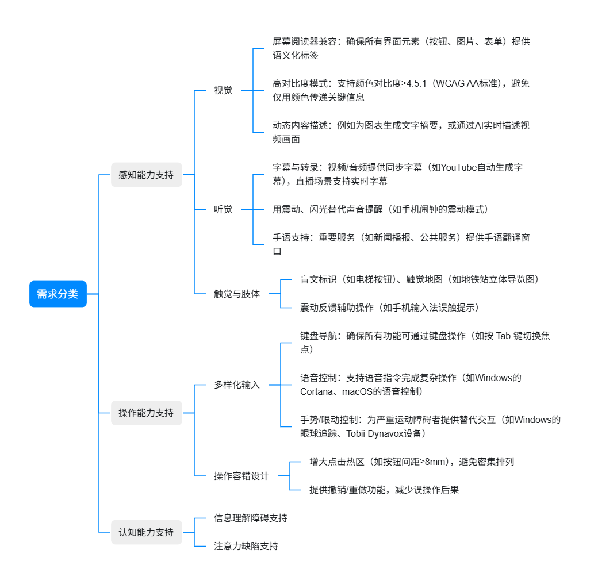

## 1.3 操作系统支持无障碍演进

| **操作系统** | **1990年代** | **2000年代** | **2010年~至今** |
| --- | --- | --- | --- |
| **Windows** | *   **Windows 95**（1995年）： **放大镜、高对比度**<br>    <br>*   **Windows 98**（1998年）： **辅助工具管理器**（Accessibility Wizard） | *   **Windows XP**（2001年）： **屏幕键盘**（On-Screen Keyboard）和**语音识别**（Speech Recognition）<br>    <br>*   **Windows Vista**（2007年）： **讲述人**（Narrator） | *   **Windows 8**（2012年）： 讲述人（Narrator）支持**触控设备**<br>    <br>*   **Windows 10**（2015年）： **无障碍功能全面升级**(讲述人支持更多语言和盲文设备、支持高对比度主题、**眼球追踪控制**和**学习工具**)<br>    <br>*   **Windows 11**（2021年）： 进一步优化讲述人，支持自然语音和AI驱动的图像描述功能 |
| **macOS** | *   **Mac OS System 7**（1991年）： **CloseView**（屏幕放大工具）和键盘快捷键支持 | *   **Mac OS X 10.4 Tiger**（2005年）：  **VoiceOver**屏幕阅读器（全功能无障碍工具）、支持盲文显示器和手势控制 | *   **macOS Sierra**（2016年）： VoiceOver支持网页动态内容（如AJAX）和更自然的语音合成<br>    <br>*   **macOS** **Catalina**（2019年）： 新增**语音控制**（Voice Control），允许用户通过语音完全操作设备<br>    <br>*   **macOS** **Monterey**（2021年）： 增强VoiceOver对复杂界面（如地图、3D模型）的支持 |
| **Linux** | *   **GNOME 1.0**（1999年）**：**基础的屏幕阅读支持（如**Gnopernicus**）<br>    <br>*   **Orca屏幕阅读器**（2004年）**：**Linux主流屏幕阅读工具，支持多语言和盲文设备<br>    <br>*   **KDE 4.0**（2008年）**：KMouth**（语音合成）和**KMag**（屏幕放大镜） |  | *   **Ubuntu 12.04**（2012年）：预装Orca，并优化对高对比度主题的支持<br>    <br>*   **GNOME 3.36**（2020年）：改进无障碍设置中心，支持实时语音反馈和更精细的键盘导航配置<br>    <br>*   AI驱动的图像描述工具 |

## 1.4 操作系统无障碍能力API

| **操作系统** | **API套件** |
| --- | --- |
| **Windows** | *   **Microsoft Active Accessibility (MSAA)**<br>    <br>    *   提供基础的无障碍信息（如控件名称、角色、状态）<br>        <br>    *   通过 `IAccessible` 接口暴露 UI 元素的属性<br>        <br>*   **UI Automation (UIA)**<br>    <br>    *   替代 MSAA，支持现代复杂 UI（如 WPF、UWP、Web 应用）<br>        <br>    *   提供丰富的控件模式（Control Patterns），例如 `ScrollPattern`、`TextPattern`<br>        <br>*   **Windows Accessibility Insights** 测试应用兼容性<br>    <br>    *   检测应用是否符合无障碍标准（如颜色对比度、键盘导航）<br>        <br>    *   提供修复建议，支持 UIA 和 MSAA 诊断<br>        <br>*   **Microsoft Sysinternal Suites Inspect**<br>    <br>    *   开发或测试应用程序无障碍元素结构<br>        <br>    *   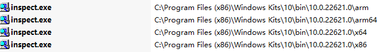<br>        <br>*   **辅助**<br>    <br>    *   **Magnification API**：支持屏幕放大镜开发<br>        <br>    *   **Speech API (SAPI)**：为语音识别和合成提供接口 |
| **macOS** | *   **Accessibility API (AX API)**<br>    <br>    *   `AppKit` 和 `UIKit` 中的 `NSAccessibility` 协议<br>        <br>    *   通过 `accessibilityLabel`、`accessibilityHint` 等属性为 UI 元素添加描述<br>        <br>    *   支持自定义控件定义无障碍角色（Role）、动作（Action）和状态（State）<br>        <br>*   **VoiceOver 专用 API**<br>    <br>    *   **VoiceOver 脚本**：通过 AppleScript 或 JavaScript 控制 VoiceOver 行为<br>        <br>    *   **AXNotifications**：监听 VoiceOver 状态（如是否启用）<br>        <br>*    **SwiftUI 无障碍支持**<br>    <br>    *   **声明式 API**：通过修饰符（如 `.accessibilityLabel`、`.accessibilityAddTraits`）直接嵌入无障碍属性<br>        <br>    *   **动态适配**：自动适配深色模式、字体大小调整 |
| **Linux** | *   **AT-SPI**（Accessibility Toolkit - Service Provider Interface）框架<br>    <br>    *   `Accessible`：定义控件的角色、名称、状态。<br>        <br>    *   `Component`：处理焦点和位置信息。<br>        <br>    *   `Text`：支持文本内容读取和编辑（如终端应用） |

## 1.5 钉钉对无障碍的支持角度

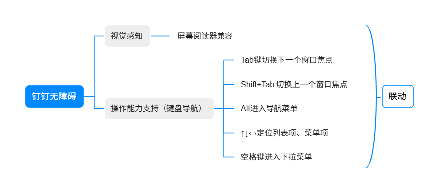

# Qt对无障碍的支持

## Qt与操作系统辅助技术

### Client-Server框架

1.  Accessibility Tools(AT Client)：比如屏幕阅读器
    
2.  Accessibility Server(AT Server)：与AT Client交互的应用程序，比如钉钉程序
    
3.  AT Server 使用`QAcessible::updateAccessibility()`发送感知UI属性信息事件通知，触发AT Client发起请求UI对象属性信息
    
4.  AT Client 使用`QAccessibleInterface`请求获取UI对象的属性信息
    

### Accessible对象树

1.  导航所有UI元素：Qt通过`QAcessible::setRootObject()`来关联AT Server和AT Client，所有可访问对象都可以使用根对象来访问。通常默认不需要自己手动设置，`QApplication`初始化时，并在`QApplication::exec()`进入事件循环之前完成
    
2.  Accessible对象树和UI对象树两者没有直接的一一映射关系，下图给出一个实例描述这样的关系：
    

| 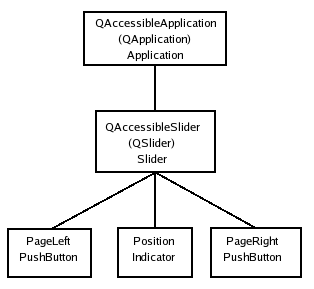 | 每个单元从上到下代表：<br>*   QAccessibleSlider：Accessible对象<br>    <br>*   QSlider：控件<br>    <br>*   Slider：控件无障碍的角色（Role）<br>    <br>*   Postion：对应滑块<br>    <br>*   PageLeft：对应滑块左侧<br>    <br>*   PageRight：对应滑块右侧<br>    <br>图中可以看出：<br>QSlider本身并没有类似~~QSliderIndicator、QSliderLeftPageButton、QSliderRightPageButton~~的QWidget对象与无障碍角色一一对应 |
| --- | --- |
| 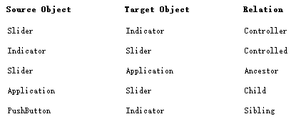 | 这里表达了Accessible对象树，可以观察图中每个无障碍对象和对象之间的关系（Relation） |

### Inspect无障碍手术刀

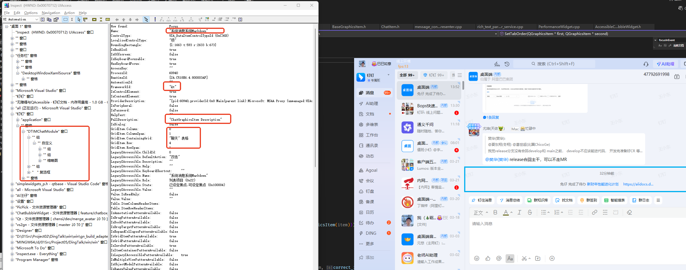

### Qt无障碍能力集成初始化

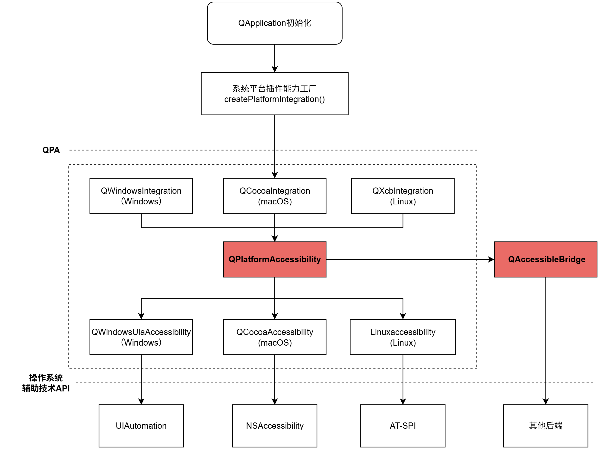

### Qt无障碍事件感知流程

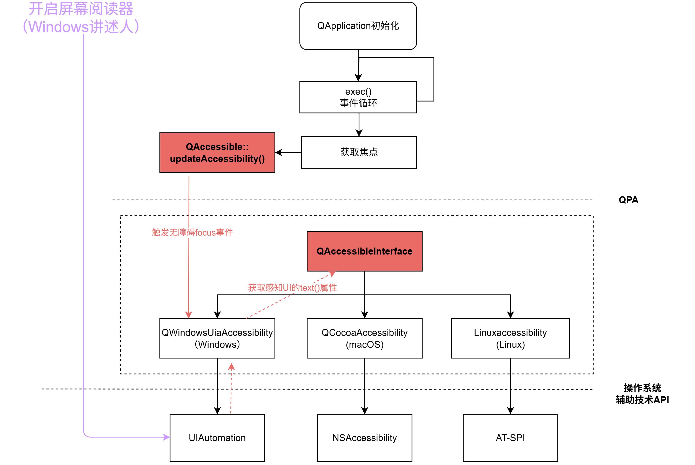

## 核心接口组成

| **核心接口** | **描述** |
| --- | --- |
| `**QAccessibleInterface**` | 获取UI元素属性**，**Qt应用使用`QAccessibleInterface` 来为辅助技术（如屏幕阅读器）提供每个UI元素的基本属性感知，元素属性由4部分构成：<br>*   角色（Role）：返回控件的无障碍角色（如按钮、文本框、列表）<br>    <br>*   文本（Text）：返回控件文本描述（如标签、值、提示）<br>    <br>*   状态（State）：返回控件的状态（如焦点、是否可见、是否可编辑）<br>    <br>*   关系（Relation）：用于定义两个可访问对象之间的逻辑关系（父子兄弟），以帮助辅助技术理解界面元素的关联性 |
| `**QAccessibleObject**` | 标准控件Accessible对象接口描述类**，**Qt已经为继承自QWidget的标准控件提供了其对应的接口描述类`QAccessibleWidget`<==> `QWidget`<br>`QAccessibleWidget : public QAccessibleObject, public QAccessibleActionInterface` |
| `**QAccessible::Event**` | 封装了等价于**MSAA**的无障碍事件类型 |
| **静态方法** |  |
| **QAccessible::queryAccessibleInterface()** | 查询当前QObject对象所能感知到的UI元素表达接口（接口工厂找不到->无障碍插件->父对象的接口），从而获取角色、文本、状态等信息 |
| **QAccessible::updateAccessibility()** | 通过调用updateAccessibility()发送`QAccessible::Event`，通知AT Clients UI元素属性的变化 |

*   接口类图（简化）
    

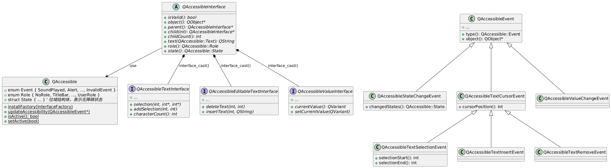

## QAccessibleCache接口缓存

`QAccessibleCache`缓存来源于3个部分：

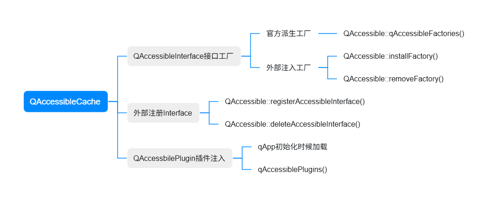

## QAccessibleInterface的官方派生（私有工厂）

| **派生** | **基类** | _**应用该接口的控件**_ |
| --- | --- | --- |
| **QAccessibleWidget** | QAccessibleObject | _QWidget_<br>_QDialog_<br>_QMessageBox_<br>_QToolBar_<br>_QSizeGrip_<br>_QSplitter_<br>_QSplitterHandle_<br>_QFrame_<br>_QRubberBand_ |
| **QAccessibleLineEdit** | QAccessibleWidget<br>QAccessibleTextInterface<br>QAccessibleEditableTextInterface | _QLineEdit_ |
| **QAccessibleDisplay** | QAccessibleWidget<br>QAccessibleImageInterface | _QLabel_<br>_QLCDNumber_<br>_QStatusBar_<br>_QToolTip(QTipLabel)_ |
| **QAccessibleComboBox** | QAccessibleWidget | _QComboBox_ |
| **QAccessibleAbstractSpinBox**<br>**QAccessibleSpinBox**<br>**QAccessibleDoubleSpinBox** | QAccessibleWidget<br>QAccessibleValueInterface<br>QAccessibleTextInterface<br>QAccessibleEditableTextInterface | _QAbstractSpinBox_<br>_QSpinBox_<br>_QDoubleSpinBox_ |
| **QAbstractSlider**<br>**QAccessibleSlider**<br>**QAccessibleScrollBar** | QAccessibleWidget<br>QAccessibleValueInterface | _QAccessibleAbstractSlider_<br>_QAccessibleSlider_<br>_QScrollBar_ |
| **QAccessibleButton**<br>**QAccessibleToolButton** | QAccessibleWidget | _QCheckBox_<br>_QRadioButton_<br>_QPushButton_<br>_QToolButton_ |
| **QAccessibleMainWindow** | QAccessibleWidget | _QMainWindow_ |
| **QAccessibleGroupBox** | QAccessibleWidget | _QGroupBox_ |
| **QAccessibleProgressBar** | QAccessibleDisplay<br>QAccessibleValueInterface | _QProgressBar_ |
| **QAccessibleMenuBar** | QAccessibleWidget | _QMenuBar_ |
| **QAccessibleMenu** | QAccessibleWidget | _QMenu_ |
| **QAccessibleTable** | QAccessibleTableInterface<br>QAccessibleObject | _QTableView_<br>_QListView_ |
| **QAccessibleTree** | QAccessibleTable | _QTreeView_ |
| **QAccessibleTabBar** | QAccessibleWidget | _QTabBar_ |
| **QAccessibleTextEdit** | QAccessibleTextWidget | _QTextEdit_ |
| **QAccessibleTextBrowser** | QAccessibleTextEdit | _QTextBrowser_ |
| **QAccessiblePlainTextEdit** | QAccessibleTextWidget | _QPlainTextEdit_ |
| **QAccessibleStackedWidget** | QAccessibleWidget | _QStackedWidget_ |
| **QAccessibleToolBox** | QAccessibleWidget | _QToolBox_ |
| **QAccessibleMdiArea** | QAccessibleWidget | _QMdiArea_ |
| **QAccessibleMdiSubWindow** | QAccessibleWidget | _QMdiSubWindow_ |
| **QAccessibleDialogButtonBox** | QAccessibleWidget | _QDialogButtonBox_ |
| **QAccessibleDial** | QAccessibleAbstractSlider | _QDial_ |
| **QAccessibleAbstractScrollArea**<br>**QAccessibleScrollArea** | QAccessibleWidget | _QAbstractScrollArea_<br>_QScrollArea_ |
| **QAccessibleCalendarWidget** | QAccessibleWidget | _QCalendarWidget_ |
| **QAccessibleDockWidget** | QAccessibleWidget | _QDockWidget_ |
| **QAccessibleWindowContainer** | QAccessibleWidget | _QWindowContainer_ |

## Qt应用如何接入无障

1.  **使用Qt标准控件（推荐）**：如2.3节描述，`qAccessibleFactory`接口工厂已经为Qt所有的标准控件支持了默认的无障碍UI属性感知。
    
2.  **自定义控件行为**：
    
    1.  熟悉`QAccessible`定义的Role、State、Relation、Event
        
    2.  继承`QAccessibleInterface`，定义每个需要被AS Client感知的元素。实操更多继承`QAccessibleObject``QAccessibleWidget`
        
    3.  手动发送Accesiblity事件`QAcessible::updateAccessibility()`，通知AS Client
        
    4.  可以直接参考源码中的实践用法，比如 `QAccessibleSlider`
        
3.  **源码中无障碍能力设置片段展示**
    

> 以QLabel为例

```c++
void QLabel::setText(const QString &text)
{
    Q_D(QLabel);
    if (d->text == text)
        return;

    QWidgetTextControl *oldControl = d->control;
    d->control = nullptr;

    d->clearContents();
    d->text = text;

    ......

    d->updateLabel();

#ifndef QT_NO_ACCESSIBILITY
    if (accessibleName().isEmpty()) {
        QAccessibleEvent event(this, QAccessible::NameChanged);
        QAccessible::updateAccessibility(&event);
    }
#endif
}
```

# 我们如何接入QAcessible

:::
[对勾] **基本原则**：

**基于Qt标准控件派生组件**

D-Design的控件库的控件或者组件

个人封装的控件或者组件

**自绘制组件设定好无障碍感知属性**，必要时继承`QAccessibleInterface`
:::

## 前置标准流程

### 设置无障碍感知的文本内容信息

Qt 中的 `QAccessible::Text` 枚举用于标识控件中不同类型的文本信息，帮助辅助技术（如屏幕阅读器）正确理解和传达用户界面内容。下面表格列出每个枚举的类型和含义：

| **枚举** | **描述** |
| --- | --- |
| QAccessible::Name | *   控件的**简短标识名称**，通常是用户看到的标签（如按钮上的文字）<br>    <br>*   屏幕阅读器读取按钮、菜单项或图标的名称 |
| QAccessible::Description | *   控件的**详细描述**，补充说明其用途或行为<br>    <br>*   当用户需要更详细的信息时，屏幕阅读器会读取此内容 |
| QAccessible::Value | *   控件的**当前值或可编辑内容**<br>    <br>*   输入框中的文本（如 `QLineEdit` 的内容）、进度条的百分比（如“50%”）、滑块或旋钮的数值 |
| QAccessible::Help | *   控件相关的帮助信息，通常是技术性说明<br>    <br>*   用户请求帮助时，辅助技术提供此信息。例如，一个错误提示框的 `Help` 可能是“请联系管理员解决此问题” |
| QAccessible::Accelerator | *   控件的快捷键（如“Ctrl+S”）<br>    <br>*   屏幕阅读器告知用户如何通过键盘快速操作控件。例如，菜单项的快捷键“Ctrl+O”对应“打开文件” |
| QAccessible::UserText | *   开发者需要提供额外的无障碍信息时使用。例如，为自定义控件添加特定的辅助说明 |

1.  **设置QAccessible::Name（必选）**：
    
    1.  调用`**QWidget::setAccessibleName()**`为每个QWidget设置好国际化后的accessibleName， 基于QAbacstractView的调用`**QStandardItem::setAccessibleText()**`
        
    2.  【降级】调用`**QWidget::setWindowIconText()**`为每个QWidget最小化后设置感知文本
        
    3.  【降级】调用`**QWidget::setWindowTitle()**`为每个QWidget设置标题感知文本
        
2.  **设置QAccessible::Description（可选）**：
    
    1.  调用`**QWidget::setAccessibleDescription()**`为每个QWidget设置好国际化后的descriptionName()
        
    2.  【降级】调用`**QWidget::setTooltip()**`为每个QWidget最小化后设置Tooltip感知文本
        
3.  **设置QAccessible::Help（可选）**：
    
    1.  调用`**QWidget::setWhatThis()**`为每个QWidget设置好国际化后的descriptionName()
        
4.  **设置QAccessible::Accelerator（可选）**：
    
    1.  使用场景：菜单导航场景，`Alt`起手，配合`Tab`可以遍历toolBar和menuBar的每一项
        
    2.  设置文本"&String"：`new QAction("&Edit", this)`启用感知文本`ALT+E`和内容组合文本
        

### 设置无障碍焦点路由管理

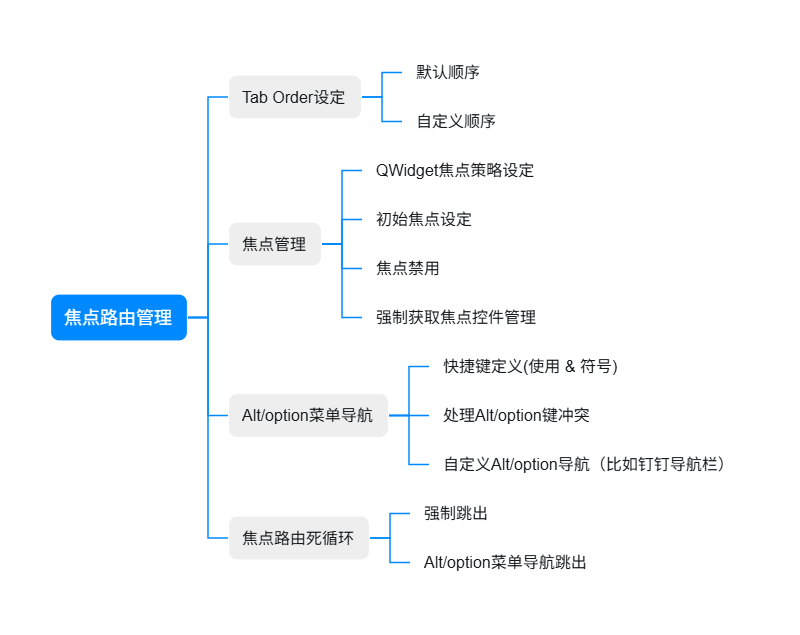

## 标准QWidget以及派生控件

1.  直接按照前置流程设置好`**QAccessible::Name**`和`**QAccessible::Description**`
    
2.  这里以我们组织面板++OrgPanelView（QListView）设置无障碍++为例：
    

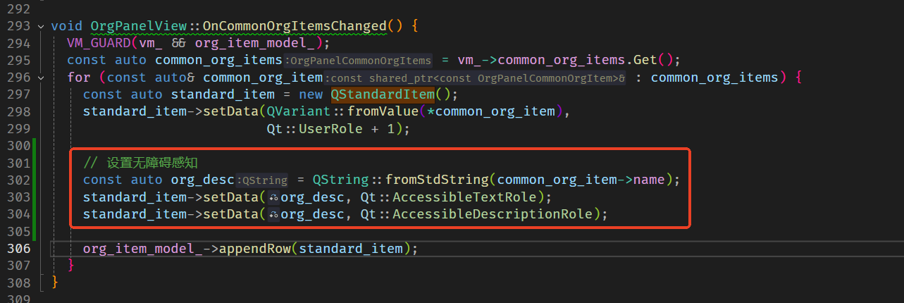

## 自绘制控件组件

以Chatbox的无障碍感知为例

### 基于QGraphicsView的QAccessibleInterface扩展

1）接口类型

| **类型** | **描述** | **典型官方派生** |
| --- | --- | --- |
| **QAccessibleInterface** | Qt无障碍接口的基础类，提供了基本的无障碍功能支持。它是其他更具体接口的基类 | QAccessibleObject |
| **QAccessibleTextInterface** | 一个用于处理文本内容无障碍访问的接口。提供了对文本内容的访问和操作功能，如获取文本、插入文本、删除文本、获取光标位置等 | QAccessibleTextWidget<br>QAccessibleLineEdit<br>QAccessibleSpinBox |
| **QAccessibleEditableTextInterface** | `QAccessibleEditableTextInterface` 是 `QAccessibleTextInterface` 的扩展，专门用于处理可编辑文本 |
| **QAccessibleValueInterface** | 一个用于处理数值型控件无障碍访问的接口。提供了获取和设置数值的功能，适用于处理数值的控件 | QAccessibleSpinBox<br>QAccessibleScrollBar<br>QAccessibleProgressBar |
| **QAccessibleActionInterface** | 一个用于处理控件操作无障碍访问的接口。提供了对控件操作的访问功能，如获取可执行的操作列表、执行操作等 | QAccessibleWidget<br>QAccessibleTabButton<br>QAccessibleMenuItem |
| **QAccessibleImageInterface** | 一个用于处理图像控件无障碍访问的接口。提供了对图像信息的访问功能，如获取图像描述、图像大小等 | QAccessibleDisplay |
| **QAccessibleTableInterface** | 一个用于处理表格控件无障碍访问的接口。提供了对表格内容的访问功能，如获取行数、列数、单元格内容等 | QListView<br>QTableView<br>QTreeView |
| **QAccessibleTableCellInterface** | 一个用于处理表格单元格无障碍访问的接口。提供了对表格单元格的访问功能，如获取单元格内容、行列索引等 |
| **QAccessibleTableModelChangeEvent** | 一个用于通知表格模型变化的事件类。当表格模型发生变化时（如插入、删除、更新行或列），会触发此事件，通知辅助技术进行相应的更新 |

2.  **Chatbox怎么做**
    

*   为什么要使用**QAccessibleTableInterface**作为继承基类
    
    *   源码里只有tableInterface()才会进行子项的focus行为
        
        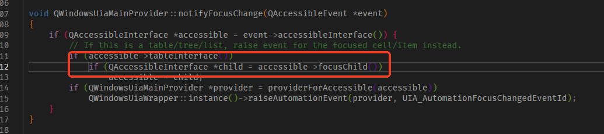
        
    *   Chatbox的UI组成很像一个表格，如下图：
        

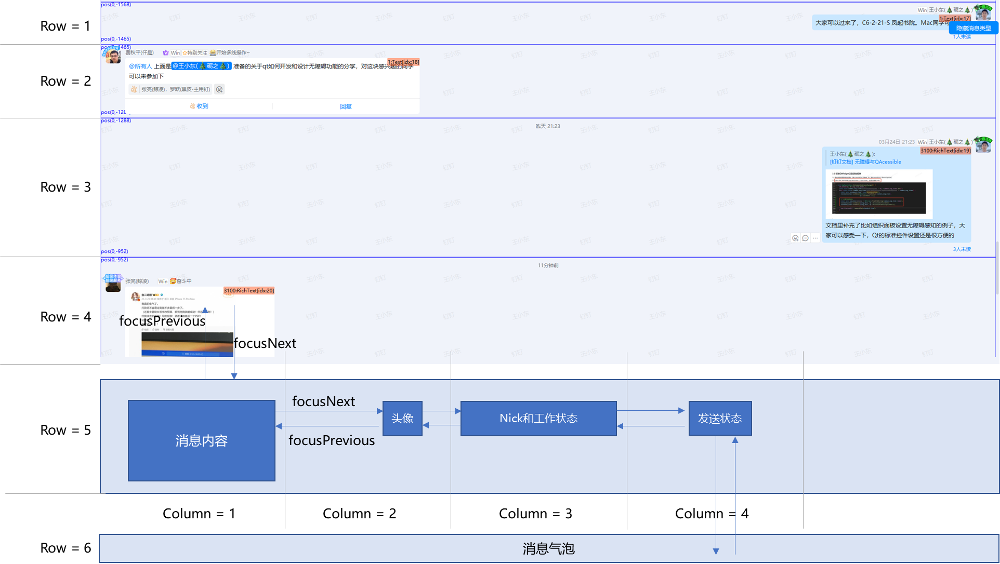

*   参考QListView无障碍的子项遍历行为：
    

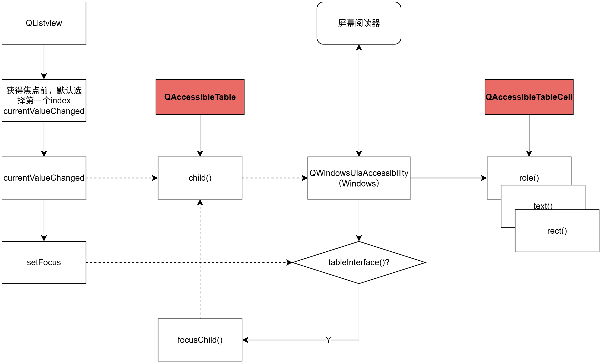

### 重新定义属性接口

1.  继承方式
    
    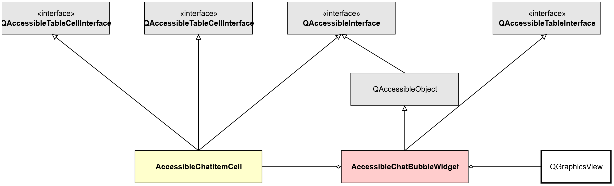
    
    下面是自定义接口注册代码：
    
    ```c++
    void ChatBubbleWidget::InitAccessible() {
      acc_ifc_ = new AccessibleChatBubbleWidget(this);
      acc_ifc_->EnableFocusElementCell(enable_focus_element_cell_);
      accessible_id_ = QAccessible::registerAccessibleInterface(acc_ifc_);
    
      setAccessibleName("聊天");
    }
    ```
    
2.  文本接口重写样例
    

```c++
QString AccessibleChatItemCell::text(QAccessible::Text t) const {
  ELEMENT_ITEM_NOT_CHAT_GRAPHICS_ITEM_RETURN_VALUE({})

  QString value;
  switch (t) {
    case QAccessible::Name:
      value = chat_graphics_item->AccessibleName();
      break;
    case QAccessible::Description:
      value = chat_graphics_item->AccessibleDescription();
      break;
    default:
      break;
  }
  return value;
}
```

### 约束气泡内的Tab Order

1.  **ItemFocus粒度配置**：按需为ChatItem子模块item增加`ItemIsFocusable``ItemIsSelectable`flag，下表定义一种++最小scope的配置++（并不希望每个Item都需要被无障碍感知）
    
    | **模块Item类** | **Order** | **描述** |
    | --- | --- | --- |
    | ChatItem | 0 | 聊天气泡消息 |
    | AvatarViewItem | 1 | 头像 |
    | NameViewItem | 2 | 昵称工作状态栏 |
    | BubbleViewItem | 3 | 气泡content |
    | StatusItem | 4 | 状态栏 |
    
2.  **focuseInEvent响应触发focusChild无障碍感知**
    
    ```c++
    void ChatGraphicsObjectItem::focusInEvent(QFocusEvent* event) {
      const int entry = AccessibleChatBubbleFocusManager::Instance()->LogicalIndex(row, col);
      QAccessibleEvent acc_event(GetGraphicsViewBelongTo(), QAccessible::Focus);
      acc_event.setChild(entry);
      QAccessible::updateAccessibility(&acc_event);
    
      QGraphicsObject::focusInEvent(event);
    }
    ```
    
3.  单个聊天气泡ChatItem设定tab order，如下示意
    
    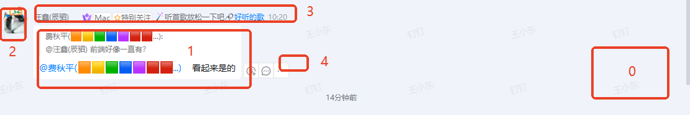
    
4.  **最终效果**
    

| **模式** | **录屏** |
| --- | --- |
| 复杂模式（类QTableView） | 请至钉钉文档查看附件《2025-03-24 11 52 19.mp4》。（内部文档） |
| 简单模式（类QListView） | 请至钉钉文档查看附件《2025-03-24 11 55 54.mp4》。（内部文档） |

# 当前面临的问题

## 异构的UI框架

| **OS** | **异构模式** | **解决方案** |
| --- | --- | --- |
| Windows | Duilib x Qt | 主钉框架Qt统一 <br> 【团队同学】   【团队同学】  <br>Duilib 和 Qt窗口之间的路由<br> 【团队同学】 <br>《windows无障碍界面开发规范》（内部文档） |
| macOS | Cococa x Qt | 保证提供的Qt组件内部焦点路由OK |

## Dingtalk应用统一焦点路由配置

1.  **框架层面增加统一的Tab Order配置管理**：比如json配置：
    
    ```json
    {
      "tab_order": [{
        "component_id":"aabbccddeeff",
        "component_name":"导航栏",
        "order":1,
      },
      {
        "component_id":"aabbccddeeff",
        "component_name":"会话列表分组",
        "order":2,
      },,
      {
        "component_id":"aabbccddeeff",
        "component_name":"搜索框",
        "order":3,
      },
      ],
      # alt导航
      "alt_navigate": {
        "component_id":"aabbccddeeff",
        "component_name":"导航栏",
      }
    }
    ```
    
2.  **增加焦点管理Manager**
    
    1.  强制获取焦点组件注册/反注册
        
    2.  初始焦点设置
        

## 已有的自绘制组件无障碍感知脱管

1.  **梳理已存在的自绘制组件**：比如下面截图里的这个组件`ddesign::IconTextButton`，图片和文字都是自绘的，我们需要++重新约束无障碍感知的元素范围++（可能只需要透出“钉住消息”这个文本）
    
    
    
2.  **确定每个自绘组件无障碍感知范围**
    

# Action

| **时间** | **关键节点** | **人** |
| --- | --- | --- |
| 2025.04 | 竞品无障碍体验调研 | 【团队同学】   【团队同学】 |
| 2025.04 | QUI工程使用的无障碍脱管控件梳理 | 【团队同学】 |
| 2025.04 ~ 2025.05 | Win无障碍框架改造 | 【团队同学】   【团队同学】   【团队同学】 |