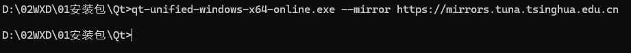
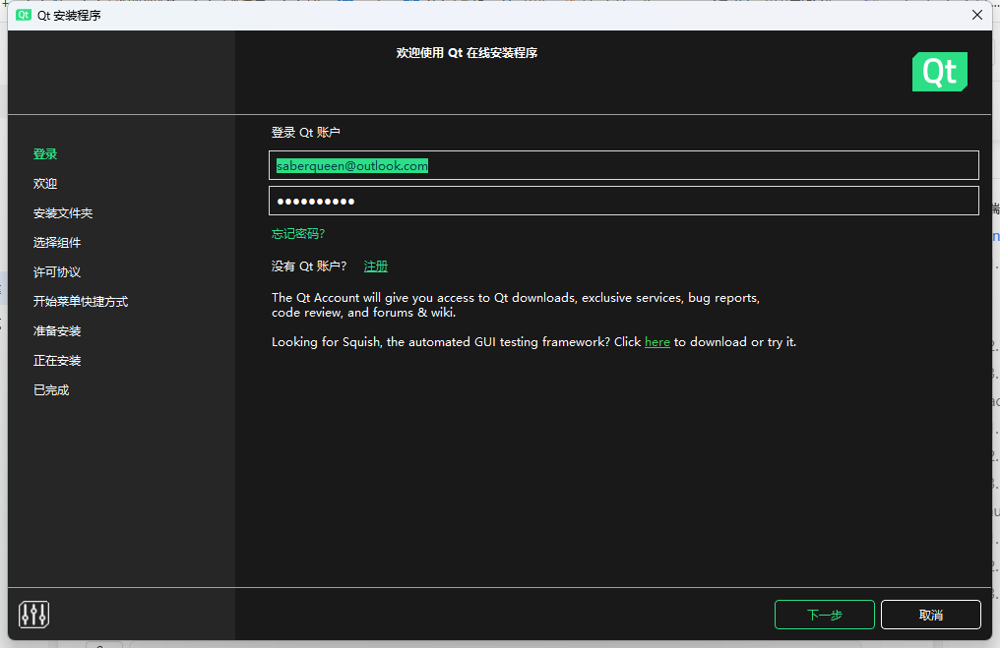
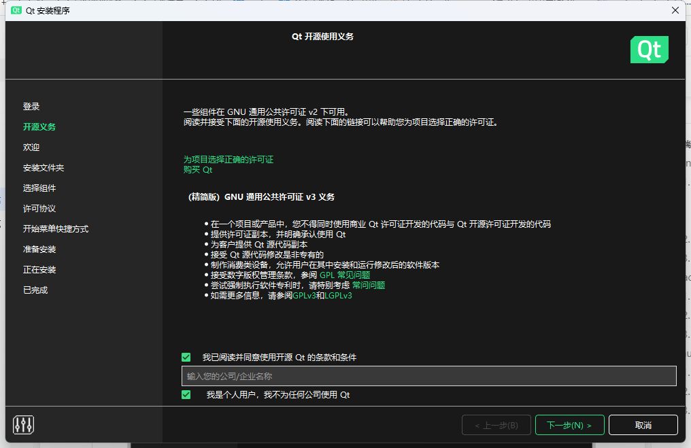
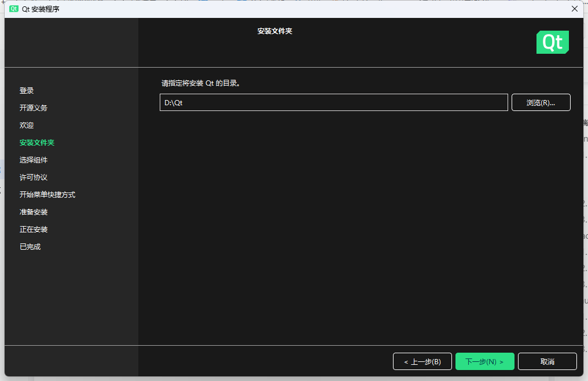
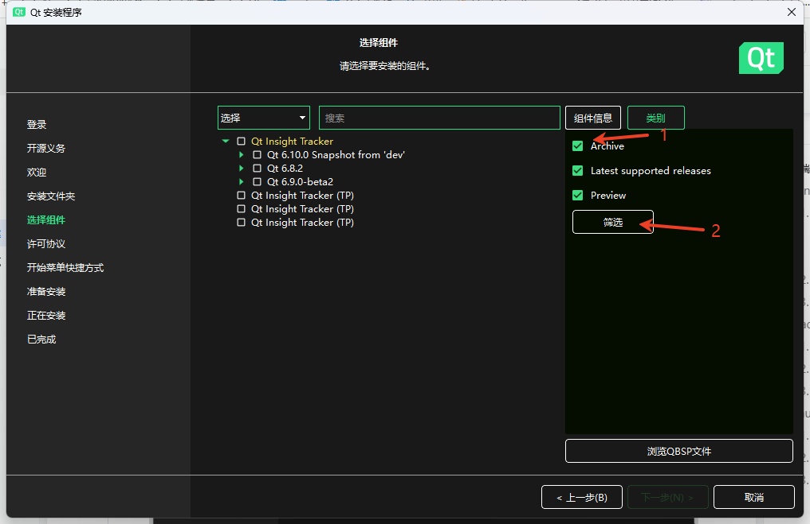
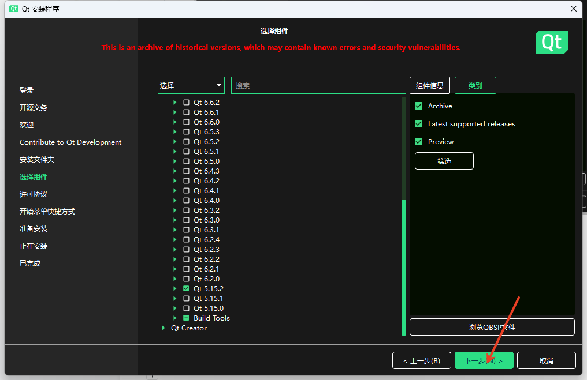
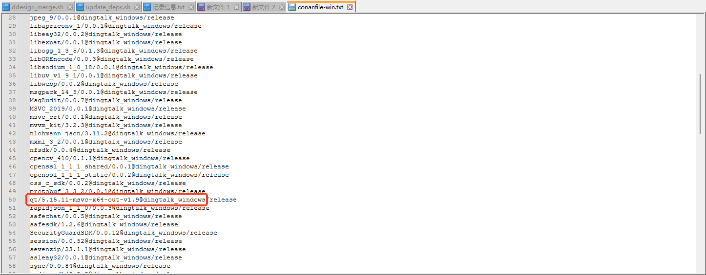
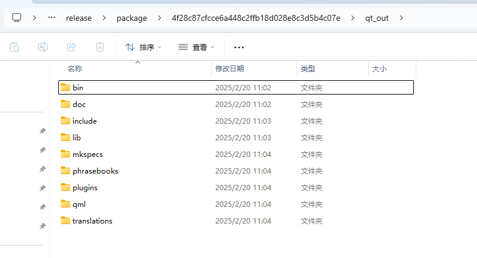
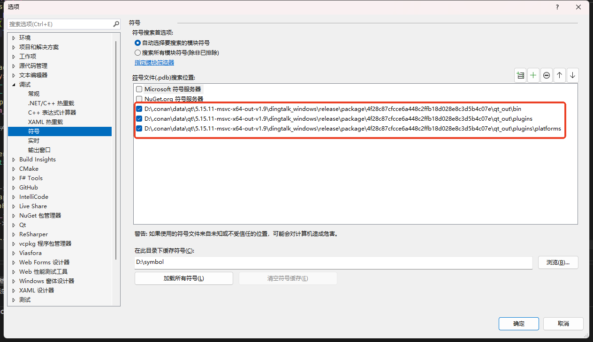
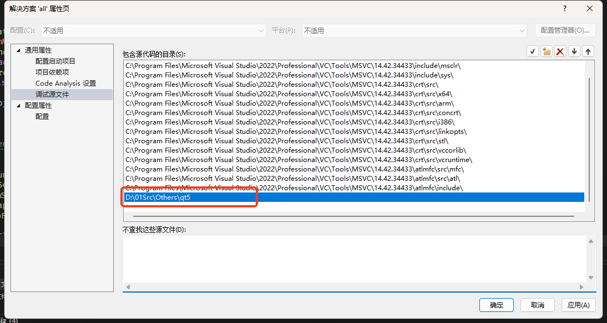

# 桌面端Qt开发环境搭建

:::
[旗子] **相关链接**

**官方地址**：

官方下载

最新版本：[https://download.qt.io/official\_releases/](https://download.qt.io/official_releases/)

归档旧版本：[https://download.qt.io/archive/](https://download.qt.io/archive/)

官方wiki：[https://wiki.qt.io/](https://wiki.qt.io/)

Bug report：[https://bugreports.qt.io/](https://bugreports.qt.io/)

官方源码地址：[https://code.qt.io/cgit/qt/qt5.git/](https://code.qt.io/cgit/qt/qt5.git/)

**镜像地址**：

最新版：[https://mirrors.tuna.tsinghua.edu.cn/qt/official\_releases/](https://mirrors.tuna.tsinghua.edu.cn/qt/official_releases/online_installers/)

归档旧版本：[https://mirrors.tuna.tsinghua.edu.cn/qt/archive/](https://mirrors.tuna.tsinghua.edu.cn/qt/archive/)

**钉钉发行版本（**《桌面端（定制）Qt 版本发行》（内部文档）**）**：


:::

# Windows  【团队同学】 

## 环境安装

### 1.1 官方版本安装

> 安装官方版本非必选（建议安装），收益：

> 1）带有Example的Qt Creator，免配置，开箱即用

> 2）官方手册assistant可以开箱即用

请使用**CMD命令行启动**[qt-unified-windows-x64-online.exe](https://mirrors.tuna.tsinghua.edu.cn/qt/official_releases/online_installers/qt-unified-windows-x64-online.exe)，来叠加镜像加速buff



```c++
qt-unified-windows-x64-online.exe --mirror https://mirrors.tuna.tsinghua.edu.cn
```

注：如果最新的online installer无法安装Qt5.15，请使用旧版本的online installer [https://download.qt.io/archive/online\_installers/4.8/](https://download.qt.io/archive/online_installers/4.8/)

1.  **安装向导**
    
    1.  
        
    2.  
        
    3.  
        
    4.  
        
    5.  
        
2.  **工具目录**
    

| **工具** | **说明** | **根目录** |
| --- | --- | --- |
| assistant.exe | 官方助手 | D:\Qt\5.15.2\msvc2019\_64\bin |
| designer.exe | ui文件编辑器 |
| moc.exe | moc预处理程序 |
| uic.exe | ui预处理程序 |
| rcc.exe | 资源预处理程序 |
| qtcreator.exe | Qt IDE | D:\Qt\Tools\QtCreator\bin |

### 1.2 钉钉发行版本安装

1.  默认在钉钉的代码仓库confile-win.txt里携带钉钉发行版本
    
    
    
2.  执行Dingtalk开发环境里的dev\_setup.sh
    
    ```c++
    sh dev_setup.sh auto
    ```
    
3.  发行版本目录
    
    > D:\.conan\data\qt\5.15.11-msvc-x64-out-v1.9\dingtalk\_windows\release\package\4f28c87cfcce6a448c2ffb18d028e8c3d5b4c07e\qt\_out
    
    
    
    ## 插件安装
    
    Qt官方为Visual Studio出了一个扩展插件：`qt-vsaddin` 
    
    ### 插件的作用
    
    1.  提供 Qt 项目模板。
        
    2.  自动配置 Qt 环境。
        
    3.  集成 Qt 工具（如 Qt Designer、Qt Linguist）。
        
    4.  支持 Qt 版本管理和模块管理。
        
    5.  提供 MOC、UIC 和 RCC 的自动化支持。
        

### Visual Studio 2022的插件安装

请至钉钉文档查看附件《qt-vsaddin-msvc2022-3.0.2.vsix》。（内部文档）

## 源码调试

> 以Visual Studio 2022为例

### PDB配置

*   进入 **工具 (Tools)** -> **选项 (Options)**。
    
*   在左侧导航栏中，展开 **调试 (Debugging)**，然后选择 **符号 (Symbols)**。
    



### 源码配置

*   本地clone++钉钉发行版本源码++（建议先安装一下Perl）
    
    ```c++
    git submodule update --init --recursive
    ```
    
*   右键**all解决方案属性页**\->**通用属性**\->**调试源文件**
    
*   添加上面clone的钉钉发行版本源码目录
    



# Mac  【团队同学】 

## 环境安装

## 插件安装

## 源码调试

# Linux  【团队同学】 

## 环境安装

## 插件安装

## 源码调试